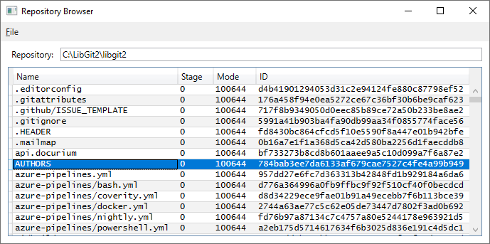
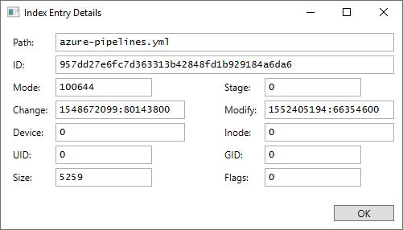
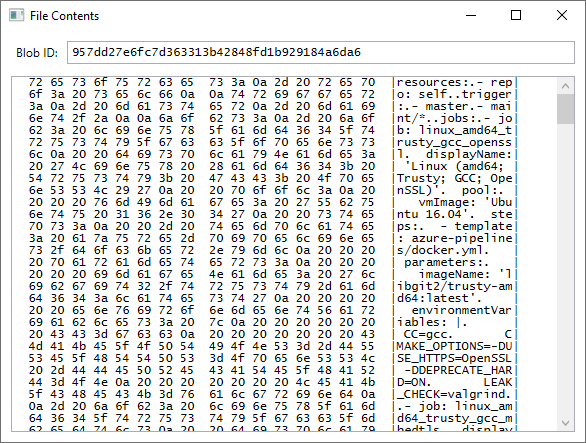

# Index Browser

A simple Windows application to display the contents of a Git repository's
index.  You can open a repository and display the file contents in the index
(the "stage").  By default, you view the files that are staged as the next
commit.

You can display the full index entry for a record, to show the on-disk
information for the file in the working directory (the "cache").

You can also view the contents of the item as it exists in the index (in
[hexdump](https://github.com/ethomson/hexdump)'s canonical format).

## Technical Information

This is a .NET Core 3 application, utilizing WPF and
[libgit2](https://libgit2.org/) via .NET bindings.

This application is Copyright &copy; Edward Thomson and available under
the [MIT license](LICENSE).
